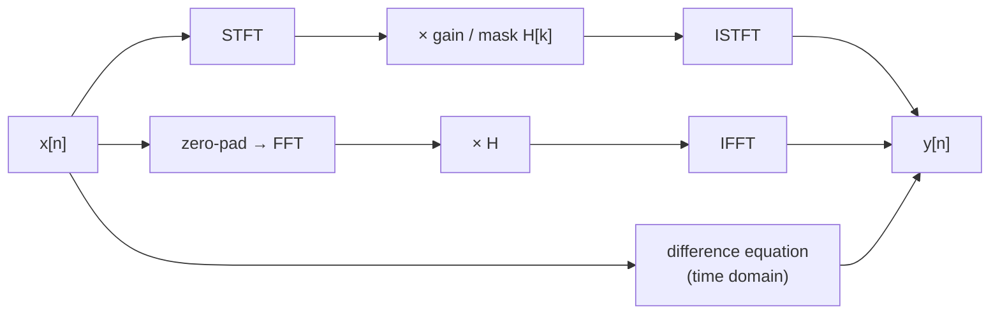

# SPECTRA

**Interactive audio signal processing.**

SPECTRA is a browser-based audio lab built for **CSE 220 (Signals & Systems) at BUET**.
Load a track and run it through five signal-processing tools:

- **EQ + Filter**
- **Reverb**
- **Echo + Delay**
- **Flanger**
- **Separation**

For each tool you can see the system that shapes the sound, compare the original with the
result, and open **Backstage**, an analysis wall that shows exactly what the tool did to the
signal.

The DSP is written from first principles with NumPy (`np.fft` and array math). There are no
black-box filters and no machine learning, and the browser never processes audio.

<!-- Add screenshots here, e.g.:


-->

---

## Contents

- [Features](#features)
- [How it works](#how-it-works)
- [Backstage](#backstage)
- [Getting started](#getting-started)
- [Project structure](#project-structure)
- [Tech stack](#tech-stack)
- [Testing](#testing)
- [Design decisions](#design-decisions)
- [Known limitations](#known-limitations)
- [Project history](#project-history)
- [Team](#team)
- [Credits and licences](#credits-and-licences)

---

## Features

| # | Tool | What it does | Core idea |
|---|------|--------------|-----------|
| 01 | **EQ + Filter** | Butterworth low-pass, high-pass, band-pass and band-stop filters, a 5-band EQ, and mains-hum removal | Multiply every STFT frame by a gain curve H[k] |
| 02 | **Reverb** | Places the sound in a synthetic room | Convolution with an impulse response, via the FFT |
| 03 | **Echo + Delay** | A single echo, or decaying repeats | Feedforward (FIR) and feedback (IIR) difference equations |
| 04 | **Flanger** | The sweeping "jet plane" effect | A comb filter whose delay is swept by an LFO |
| 05 | **Separation** | Splits a mix into **percussion, bass, vocals and harmonics** | NMF with Wiener-style soft masks |
| — | **Backstage** | Analysis of any run | Spectrograms, difference map, levels, system response |

### Lab features

- **Live system response.** The frequency response or impulse response redraws as you move the
  sliders, before anything is processed.
- **Before/after players.** Two waveform players, Original and Processed, drawn at the same
  scale so level changes are visible.
- **Send to.** Pass a result or a separated stem to any tool. This lets you chain effects
  (EQ → Reverb → Echo) or process a single stem (vocals → Reverb).
- **Stem mixer.** Play all stems in sync, with per-stem volume, mute and solo.
- **Presets.** Telephone, Radio, Remove rumble, Remove hum 50 Hz and Bass boost.
- **Educational switches.** For example, the reverb's *circular convolution (wrong way)* toggle
  makes the classic zero-padding mistake audible.
- **Drawers and sliders.**
  - A **How it works** drawer for every tool, with its equations and one line per parameter.
  - Editable slider readouts that accept values like `3.4k`.
  - Double-click a slider to reset it.
- **Interface.** Dark and light themes, keyboard support, reduced-motion support.
- **Runs fully offline.** All scripts and fonts are bundled locally.

---

## How it works

Every tool takes a signal x[n] to an output y[n] along one of three paths, depending on which
domain suits the tool:



The top path is EQ, filters, hum removal and Separation. The middle path is Reverb. The bottom
path is Echo and Flanger.

### EQ + Filter

The tool computes a static gain curve at every FFT bin, multiplies every STFT frame by it, and
reconstructs the signal with overlap-add.

- **Filters.** The closed-form Butterworth magnitude response
  `|H(f)| = 1 / √(1 + (f/fc)^(2N))`, with order N from 1 to 8.
  - Band-pass is a low-pass multiplied by a high-pass.
  - Band-stop uses the low-pass-to-band-stop transform `f/fc → B·f / (f0² − f²)`.
- **5-band EQ.**
  - Bands: a low shelf at 100 Hz, Gaussian peaks at 350 Hz, 1 kHz and 3.5 kHz, and a high shelf
    at 10 kHz.
  - Each band has ±15 dB of gain. The band gains are summed in dB, then converted to linear gain.
- **Hum removal.** Order-4 Butterworth notches at the mains frequency (default 50 Hz) and its
  harmonics.
- **Long frames.** The tool uses **65,536-sample frames**, which give a bin spacing of 0.67 Hz at
  44.1 kHz. With 1024-sample frames (43 Hz bins), a 50 Hz notch only reached 4.5 dB deep; with
  long frames it reaches **48 dB**. The coarser time resolution costs nothing here, because the
  curve is the same for every frame.
  See [`docs/long frames for EQ,filters and hum.md`](docs/).

### Reverb

`y = x * h ⟷ Y = X · H`, the convolution theorem.

- **Impulse response.** The impulse response is synthetic: white noise multiplied by
  `exp(−ln(1000)·t / RT60)`, which is −60 dB at t = RT60. It starts after a pre-delay and is
  normalised to unit energy.
- **Linear convolution.** Both signals are zero-padded to at least `N + M − 1` samples, so the
  output keeps its full reverb tail.
- **Circular toggle.** This deliberately skips the padding, so the tail wraps around onto the
  start of the track.

### Echo + Delay

- Feedforward (FIR): `y[n] = x[n] + g·x[n − D]`
- Feedback (IIR): `y[n] = x[n] + g·y[n − D]`

The feedback form is stable only for g < 1, so the gain is capped at 0.9. Both forms are comb
filters, with peaks every sr/D Hz.

The feedback loop is vectorised **exactly**: each block of D samples depends only on the
previous block, so the loop runs once per block instead of once per sample.

### Flanger

`y[n] = x[n] + g·x[n − D(n)]`, where the delay follows a raised-cosine LFO:
`D(n) = min + sweep·(1 − cos 2π·rate·t)/2`.

- **Sweep.** The comb's notches, at odd multiples of 1/(2D), move up and down the spectrum as
  the delay changes.
- **Fractional delay.** Delays that fall between samples use linear interpolation.
- **Animated plot.** The response plot animates |H| over one full sweep.

### Separation

The separation algorithm was written by Ananta. `effects/separation.py` wraps it for the app.

1. STFT with 2048-sample frames and 50% overlap, then the magnitude spectrogram V.
2. **NMF, `V ≈ W·H`,** with 20 components and 300 multiplicative-update iterations.
   - The cost is a KL-style divergence plus a temporal-continuity penalty (after Virtanen).
   - It uses a fixed seed, so results are deterministic.
3. Each component is scored on spectral features (bass, high-band, flatness, harmonicity),
   activation features (transientness, sustain, rhythm) and vocal features (mid-band, formant
   energy, envelope smoothness).
4. The components are grouped into **percussion, bass, vocals and harmonics**.
5. Wiener-style soft masks are normalised to sum to 1 at every bin, so **the stems add up exactly
   to the original mix**.
6. The masks are applied to each channel's STFT, which keeps stereo intact.

---

## Backstage

Backstage is a read-only analysis wall for any run. Every figure has a **LOOK FOR:** caption
that tells you what to notice.

| Figure | Shows |
|---|---|
| Spectrograms | Original vs processed |
| Difference spectrogram | `20·log10(|Y|/|X|)` per bin: cyan = boosted, magenta = cut |
| System response | The exact response used for this run |
| Average spectrum | Tonal balance before vs after |
| Waveform overlay | Level changes and tails |
| Levels | Peak, RMS, crest factor and duration, before and after |
| STFT settings | Frame, hop, window, Δf = sr/N (EQ runs show both frame sizes) |
| Tool-specific | Linear vs circular reverb; echo impulse train; flanger delay sweep |
| Separation | Mixture spectrogram, stem levels, stem mask heatmaps (where bleed happens) |

Analyses are computed once and cached on disk.

---

## Getting started

### Requirements

- **Python 3.12 or newer.** NumPy 2.5 and SciPy 1.18 require it.
- No ffmpeg is needed: `soundfile` reads WAV, FLAC and MP3 directly.

### Run

```bash
git clone <this-repo-url>
cd <repo-folder>

# Windows
run.bat

# macOS / Linux
bash run.sh
```

The run script:

1. Creates a `.venv`.
2. Installs `requirements.txt`, and only again when that file changes.
3. Starts the app at **http://127.0.0.1:5000**.

After the first install, the app works **completely offline**.

| Page | URL |
|---|---|
| Landing page | http://127.0.0.1:5000/ |
| The lab | http://127.0.0.1:5000/lab |

Manual alternative:

```bash
python -m venv .venv
.venv/bin/pip install -r requirements.txt      # Windows: .venv\Scripts\pip ...
.venv/bin/python app.py
```

### Useful options

| Command / variable | Effect |
|---|---|
| `run.bat --clean` / `bash run.sh --clean` | Delete old uploads and results before starting |
| `python scripts/warmup.py` | With the app running, run every tool once and print PASS/FAIL with timings |
| `SPECTRA_DEBUG=1` | Flask debug mode (off by default) |
| `SEPARATION_MOCK=1` | Separation returns copies of the input as stems (a fallback for demos) |

### Limits

- Uploads: WAV, MP3 or FLAC, up to **200 MB** and **20 minutes**.
- Separation takes about 0.4 s per second of audio. The 30 s demo song takes about 12 s.

---

## Project structure

```text
app.py                 Flask app: routes, parameter parsing, result naming, spectrograms
ui_config.py           Per-tool labels, units, slider steps, "How it works" text, presets
runs.py                Run registry (in memory + <run_id>.run.json sidecars)
effects/
  eq_filter.py         EQ, Butterworth filters, hum notches, presets (65,536-sample STFT)
  reverb.py            Synthetic impulse response + FFT convolution (linear and circular)
  echo.py              Feedforward / feedback comb filters + frequency response
  flanger.py           LFO-swept fractional delay + animated responses
  separation.py        Wrapper around the NMF separation pipeline
  common.py            Per-channel processing and clipping protection
analysis/
  backstage.py         All Backstage analysis
  waveform.py          Min/max envelopes for the waveform players
stft.py                Shared STFT / ISTFT (Hann window, overlap-add)
utils.py               Shared helpers (magnitude, masks, spectrograms, audio I/O)
semi_supervised_nmf.py NMF with temporal continuity (multiplicative updates)
nmf_sep.py             Component features, scoring and soft masks
templates/             index.html (the lab), landing.html
static/                JS modules, CSS, vendored Chart.js + WaveSurfer, fonts, demo audio,
                       landing assets
scripts/               warmup.py, clean_runs.py, make_landing_assets.py, make_placeholder_demo.py
tests/                 pytest suite
docs/                  Stage specs and the long-frame measurements
```

---

## Tech stack

| Layer | Technology |
|---|---|
| Backend | Python 3.12+, Flask 3.1 |
| DSP | NumPy 2.5 (all effects) |
| Separation extras | pandas (component table); SciPy `find_peaks` (rhythm measurement only) |
| Audio I/O | soundfile 0.14 (libsndfile, with MP3 support) |
| Images | Matplotlib 3.11 (server-side spectrogram PNGs) |
| Frontend | HTML, CSS, vanilla ES modules (no framework, no build step) |
| Charts / players | Chart.js 4.5, WaveSurfer.js 7.12 (both bundled locally) |
| Fonts | Big Shoulders Display, Martian Mono (self-hosted) |
| Tests | pytest 9.1 |

---

## Testing

```bash
python -m pytest tests -m "not slow"   # 281 tests, about 2 minutes
python -m pytest tests -m slow         # performance tests on 6 min of stereo audio
```

Highlights:

- **Effects vs references.** Every effect is checked against a naive reference implementation:
  direct convolution, and per-sample difference-equation loops.
- **The curve really applies.** Sine tones played through the EQ are changed by exactly the
  plotted amount.
- **Separation.** The stems sum to the mix, and results are deterministic and scale-invariant.
- **Offline.** A test checks that no page loads anything from the internet.

---

## Design decisions

**No black boxes.** Every effect is implemented from its equations with NumPy. The code does
not use `scipy.signal` filter design, `lfilter`, `fftconvolve` or `np.convolve`, and it uses no
Web Audio effect nodes and no ML. Libraries are used only for I/O, playback and drawing. The
point of the project is to show *how* each effect works, not to call one.

**The right domain for each tool.**

- Tone shaping and separation are multiplications in the STFT domain.
- Reverb is an FFT convolution.
- Echo and flanger are difference equations in the time domain.

**A different frame size for each job.**

| Use | Frame size | Why |
|---|---|---|
| Spectrograms | 1024 samples | Good time detail |
| Separation | 2048 samples | A balance of time and frequency detail |
| EQ | 65,536 samples | Fine frequency resolution; its curve never changes over time |

**The browser only plays and plots.** All processing happens on the server, so what you see in
the plots is exactly what was applied to the audio.

**Synchronous Flask.** Classical DSP finishes in seconds, so there is no job queue. An earlier
ML-based design needed WebSockets and background jobs; dropping ML made that complexity
unnecessary.

---

## Known limitations

- **Separation bleed.** Where two instruments share the same frequencies at the same moment, a
  magnitude mask can't fully split them. Backstage's mask heatmaps show where this happens.
- **Separation speed.** About 0.4 s per second of audio, and only one separation runs at a time.
- **Hum at the edges.** A little hum remains in the first and last ~0.5 s. Any notch this
  narrow needs that much signal to resolve.
- **Single-user design.** The app is built for local use: it has no authentication, and results
  are stored on local disk until cleaned.
- **Naming.** `semi_supervised_nmf.py` includes a template-initialisation routine
  (`initialize_B`) that is currently disabled, so the running separation is unsupervised NMF
  with temporal continuity.

---

## Project history

SPECTRA began as **Stemify**, a music source separator. The first design used a pretrained
neural separator (htdemucs) as the mask estimator inside our own STFT pipeline. Our supervisor
judged that this moved away from the course's signal-processing focus, so we replaced it with
classical **NMF**. We then measured NMF's real limitation (bleed between overlapping sources)
for ourselves.

Following that feedback, the project was redesigned as a broader **signal-processing lab**. In
the lab, separation is one tool among several, and every tool is built from first principles
and made visible through its system response and Backstage analysis.

---

## Team

| Member | Contributions |
|---|---|
| **Wasik Samin** | Flask app, EQ + Filter, Reverb, Echo + Delay, Flanger, Backstage, frontend, landing page |
| **Ananta Debnath** | Separation algorithm (NMF, component scoring, soft masks), shared STFT utilities, integration |

CSE 220: Signals & Systems, Bangladesh University of Engineering and Technology (BUET).

---

## Credits and licences

- **Demo song (Separation tab):** "Let's Go Fishin'" by Karissa Hobbs, licensed
  **CC BY-NC-SA 4.0**. Full credits are in `static/demo/CREDITS.txt`.
- **Demo track (other tools):** synthetic, generated by `scripts/make_placeholder_demo.py`.
- **Fonts:** Big Shoulders Display and Martian Mono, under the SIL Open Font License. The licence
  files are in `static/fonts/`.
- **Libraries:** Chart.js and WaveSurfer.js (bundled in `static/vendor/`), plus the Python
  packages listed in `requirements.txt`, each under its own licence.
- **Separation method:** after T. Virtanen, *Monaural Sound Source Separation by Nonnegative
  Matrix Factorization With Temporal Continuity and Sparseness Criteria*, IEEE TASLP, 2007.
